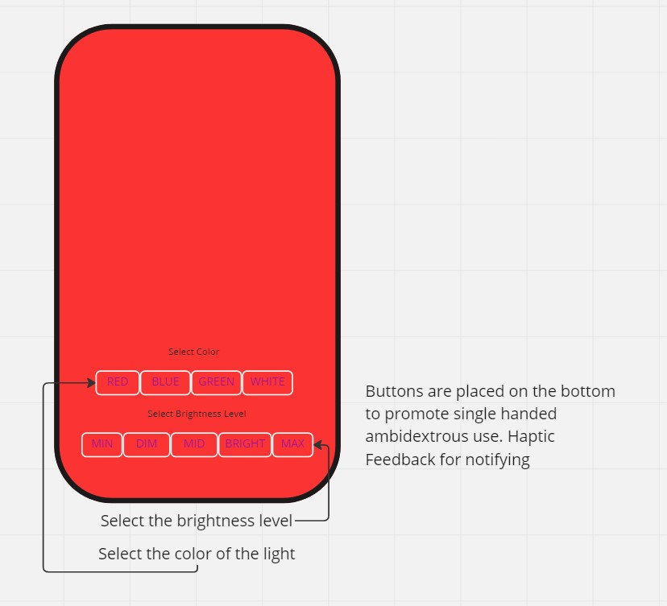
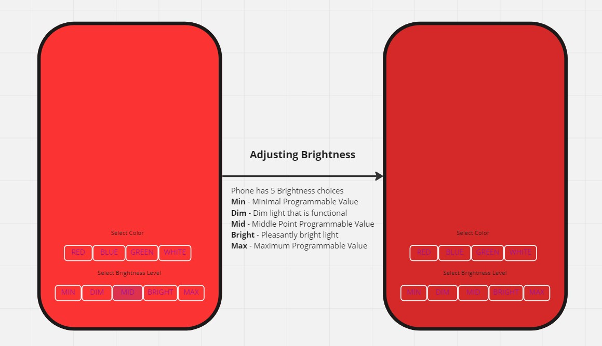
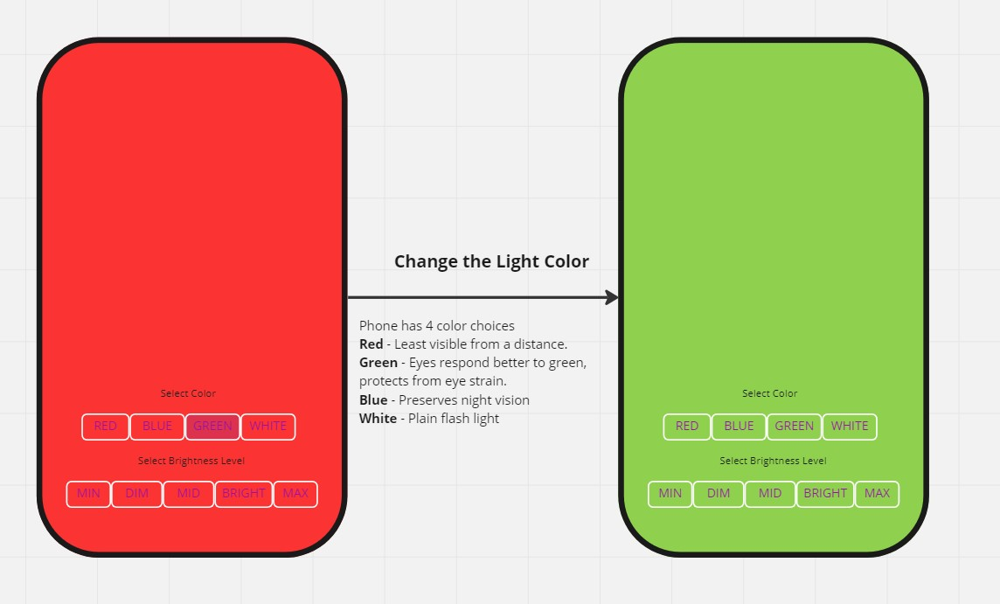
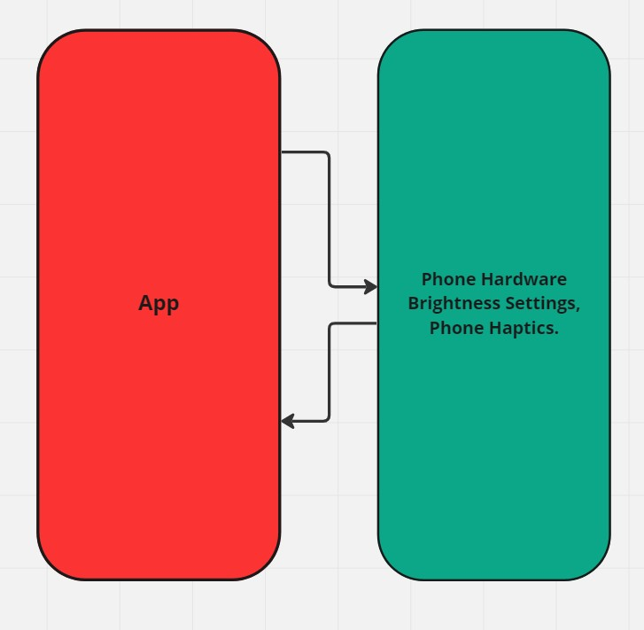

# tacti-light

## Author: Trace Dugar

## Description

Tactile, single hand use, phone screen flashlight app with 5 brightness settings. Min - 0% , Dim - 20%, Mid - %50, Bright - 80%, Max - 100%.  Buttons give you haptic feedback whenever pressed. Button placement promotes ambidextrous single handed use. Red was the chosen default because it is the color least visible from a distance.  Additional color choices include Blue, Green, and White.  The fact that the screen is the light will use less battery than the camera flashlight.

## Links and Resources

 [Github Repository](https://github.com/TraceDugar/good-call),
 [Chat GPT](https://openai.com/blog/chatgpt/)

### Running the application

- `npm start`

### Features and Routes

- Feature 1: Red Flashlight with 5 settings.
- Feature 2: Touch Feedback upon Button Press.
- Feature 3: Add Light Color Changes (Red, Blue, Green, White).
- Feature 4: Button styling promotes single handed usage (Left or Right).

#### Tests

N/A

#### UML / Diagrams

